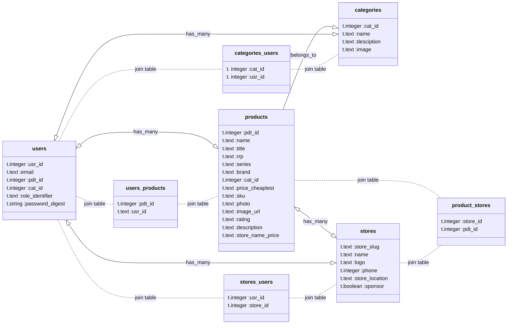

# Class Diagram


## products
* store_name_price
    * Includes a hash of he store and its price 
* series 
    * Addiional info about a product such as its line, model or alternative sub-brand

## stores
* 

# Migration Files
*


# Models & Views

```rb
# app > model products.rb
    belongs_to :categories
```

```rb
# app > model product_categories.rb
    has_many :products
```

```rb
# app > model stores .rb
```

```rb
# app > model users.rb
    has_many :products
    has_many :product_categories
    has_secure_password
    validates :email, :uniqueness => true, :presence => true
```

# Basic AR Associations

- belongs_to
- has_many 
- has_and_belongs_to_many

## Examples of associations

```rb
reference assosciations

class Song < ApplicationRecord
    has_and_belongs_to_many :mixtapes
    has_and_belongs_to_many :genres
    belongs_to :artist, :optional => true
    belongs_to :album, :optional => true
end
class User < ApplicationRecord
    has_many :mixtapes
    has_secure_password
    validates :email, :uniqueness => true, :presence => true
end
class Mixtape < ApplicationRecord
    belongs_to :user, :optional => true
    has_and_belongs_to_many :songs
end
class Genre < ApplicationRecord
    has_and_belongs_to_many :songs
end
class Artist < ApplicationRecord
    has_many :songs
    has_many :genres, :through => :songs
end
class Album < ApplicationRecord
    has_many :songs
end
class ApplicationRecord < ActiveRecord::Base
  self.abstract_class = true
end
```

# Finding data

```
Key
* That I have: S
* That I can obtain (via api/scraping etc): A
* That I want: P
* Thats genereated: G
* May be needed: O
* mant: Mandatory
* opt: Optional
```